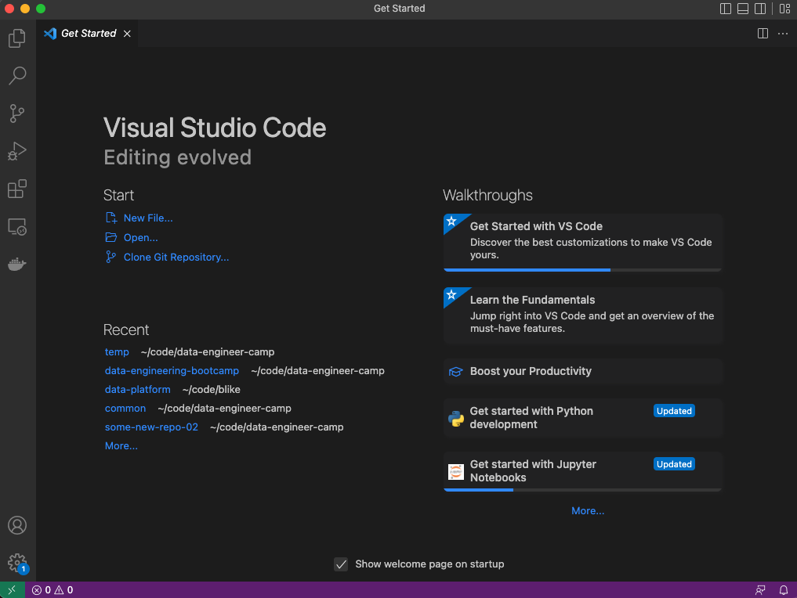

# Install VS Code 

Visual Studio Code (VS Code) is a free code editor that we will use throughout this bootcamp.

To download VS Code, please go to https://code.visualstudio.com/ and select "Download". 

Download the version that matches your Operating System (Windows, MacOS Intel Chip, MacOS Silicon Chip). 

You have successfully downloaded VS Code when you see a window that looks like this: 

